# FIELDNOTE 소프트웨어 아키텍처 — arc42

| 항목 | 값 |
| --- | --- |
| 시스템 | FIELDNOTE Offline Field Inspection |
| 문서 상태 | Current implementation + explicitly marked target gaps |
| 기준일 | 2026-09-02, Australia/Sydney |
| 코드 구현 기준선 | `feature/offline-inspection-reliability`, `11a89f5` |
| 문서 변경 | 이 문서를 추가하는 별도 commit으로 추적 |
| 릴리스 판정 | **Production NO-GO** |
| 독자 | PM, 기획자, 개발 계획자, 개발자, QA, CI/CD·운영 담당자 |

이 문서는 [공식 arc42 템플릿](https://docs.arc42.org/home/)의 12개 섹션을 따른다. 정적 구조는 표기법에 독립적인 [C4 모델](https://c4model.com/diagrams)의 Context, Container와 Component 관점으로 설명하고, 동적 동작과 도메인 상태는 UML 관점의 Mermaid sequence, state와 class diagram으로 설명한다.

> 이 문서는 코드에서 확인된 현재 구조를 우선한다. 외부 IdP, 원격 사진 저장소, 관리형 데이터베이스, 실제 staging/production 환경은 계획 대상이며 현재 컨테이너로 간주하지 않는다.

## 목차

1. [소개와 목표](#1-소개와-목표)
2. [아키텍처 제약](#2-아키텍처-제약)
3. [컨텍스트와 범위](#3-컨텍스트와-범위)
4. [솔루션 전략](#4-솔루션-전략)
5. [빌딩 블록 뷰](#5-빌딩-블록-뷰)
6. [런타임 뷰](#6-런타임-뷰)
7. [배포 뷰](#7-배포-뷰)
8. [횡단 관심사](#8-횡단-관심사)
9. [아키텍처 결정](#9-아키텍처-결정)
10. [품질 요구사항](#10-품질-요구사항)
11. [위험과 기술부채](#11-위험과-기술부채)
12. [용어집](#12-용어집)

---

## 1. 소개와 목표

### 1.1 요구사항 개요

FIELDNOTE는 네트워크가 불안정하거나 끊기는 현장에서 검사를 생성하고, 체크리스트와 사진 증빙을 장치에 먼저 저장하며, 연결이 복구되면 companion API와 안전하게 동기화하는 local-first 현장 관리 도구다.

핵심 기능 범위는 다음과 같다.

- 프로젝트 범위의 검사 생성, 검색, 필터, 상세 조회와 CSV export
- 버전이 지정된 게시 템플릿으로부터 검사 snapshot 생성
- `Draft → Submitted → Approved` 및 `Submitted → Draft` 업무 흐름
- 장치 검사, 사진 Blob과 durable outbox의 오프라인 영속화
- 원 작성자를 보존하는 batch sync, idempotency와 optimistic revision
- 서버 ACK 이후 queue 정리 및 명시적인 revision conflict 복구
- Inspector, Reviewer, Admin 데모 역할과 프로젝트 권한, 작성자-승인자 분리
- PWA app shell, offline cold start, health, metrics와 immutable artifact 검증

상세 사용자 사례와 자동화 근거는 [제품 워크플로우 및 검증](../product-workflows-and-verification.md)에 있다.

### 1.2 최상위 품질 목표

우선순위가 충돌하면 위에 있는 목표를 먼저 지킨다.

| 우선순위 | 품질 목표 | 구체적인 의미 |
| --- | --- | --- |
| 1 | 데이터 유실 방지 | 장치 저장 완료 전 성공을 표시하지 않고, 실패·quota·hydrate 경쟁에서 사용자의 기록을 보존한다. |
| 2 | 신뢰 경계 보호 | 프로젝트 membership, 역할 권한, 상태 전이와 작성자-승인자 분리를 서버에서 재검증한다. |
| 3 | 정직한 상태 표현 | `localSaveStatus`와 `syncStatus`를 분리하고 서버 ACK가 없으면 원격 완료라고 표시하지 않는다. |
| 4 | 오프라인 사용성 | cached app shell과 IndexedDB 기록으로 연결 없이 기존 검사를 열고 편집할 수 있어야 한다. |
| 5 | 재현 가능한 변경·릴리스 | 테스트, coverage, production artifact E2E와 checksum gate로 동일 source의 산출물을 재현한다. |

### 1.3 이해관계자

| 이해관계자 | 관심사와 기대 |
| --- | --- |
| Inspector | 현장에서 빠르게 검사하고, 연결이 없어도 저장 여부를 확실히 알며, 제출 조건을 이해한다. |
| Reviewer | 작성자와 분리된 권한으로 Submitted 검사를 반려하거나 승인한다. |
| Admin | 허용된 여러 프로젝트를 운영하고 read/write/export/approve 경계를 관리한다. |
| PM·기획자 | 사용자 흐름, Production 차단 요인과 로드맵 우선순위를 추적한다. |
| 개발 계획자·개발자 | 모듈 경계, 데이터 권위, API와 변경 영향을 파악한다. |
| QA | 품질 시나리오와 테스트 증거를 연결하고 회귀 범위를 결정한다. |
| CI/CD·운영 담당자 | artifact 무결성, health, metrics, backup, rollback과 배포 차단 조건을 확인한다. |

### 1.4 현재 릴리스 판정

현재 결과는 **테스트된 로컬 통합**이다. 다음 네 항목이 없으므로 Production NO-GO다.

1. 외부 IdP/JWT, 만료·폐기·key rotation과 queued action 재인가
2. 사진 binary의 원격 업로드, checksum 검증과 object storage
3. 관리형 transactional database, 다중 인스턴스 동시성과 복구 훈련
4. 실제 HTTPS host, staging 승격, canary, 관측성 연결과 자동 rollback

## 2. 아키텍처 제약

### 2.1 기술 제약

| 영역 | 현재 제약 |
| --- | --- |
| Client | Angular 20.3 standalone SPA, TypeScript 5.9, RxJS 7.8, Angular Service Worker |
| Server | Node.js 22, 내장 모듈만 사용하는 ESM 단일 프로세스 |
| Browser API | IndexedDB, Cache Storage, Service Worker, Blob/Canvas, Web Crypto, localStorage, sessionStorage, `navigator.onLine` |
| 지원 증거 | Playwright E2E는 현재 Chromium만 실행한다. Safari/iOS/Android 지원은 검증되지 않았다. |
| Client schema | inspection IndexedDB v2, photo IndexedDB v1, outbox IndexedDB v1 |
| Server schema | JSON state `STORAGE_VERSION = 1`; 다른 version은 시작을 거부한다. |
| Locale | Angular `en-AU`; 영속 시간은 ISO timestamp를 사용한다. |
| PWA | production build에서만 Service Worker가 활성화되고, 안정화 후 최대 30초에 등록된다. |
| API endpoint | 기본값 `http://127.0.0.1:8787`; 실제 hosted endpoint 주입은 아직 application provider에 연결되지 않았다. |
| Server persistence | `server/data/fieldnote.json` 한 파일을 전체 snapshot으로 다시 쓴다. |

### 2.2 정량 제약

| 항목 | 제한 |
| --- | --- |
| 원본 사진 입력 | JPEG/PNG/WebP, 최대 10 MiB |
| 이미지 처리 | 최대 1920 px, 기본 JPEG quality 0.82 |
| 압축 사진 Blob | 사진당 5 MiB |
| 프로젝트 사진 합계 | 100 MiB |
| Server 사진 metadata | 검사당 최대 50개; binary는 전송하지 않음 |
| Checklist | 검사당 최대 500개 |
| Sync batch | 1~100개 operation |
| HTTP JSON body | 기본 1 MiB, 설정 가능 범위 1 KiB~10 MiB |
| Client request timeout | 기본 15초 |
| 자동 retry backoff | 1초에서 시작해 최대 60초 |
| Angular initial bundle | warning 750 KiB, error 1 MiB |
| Component style | warning 18 KiB, error 24 KiB |

### 2.3 조직·운영 제약

- GitHub Actions 품질 gate는 pull request, `main` push와 수동 실행에만 동작한다. topic branch push만으로는 실행되지 않는다.
- client와 server는 별도 immutable artifact로 패키징하지만 실제 배포 job과 host는 없다.
- artifact 보존 기간은 GitHub Actions에서 14일이다.
- demo identity, token과 seed inspection이 source/bundle에 포함된다.
- `/metrics`와 `/healthz`는 애플리케이션 인증 없이 공개된다. 네트워크 ACL이나 collector는 아직 없다.
- 실제 운영 SLA, 저장 latency, API p95, 최대 outbox age와 장기 용량 SLO는 합의되지 않았다.

### 2.4 규칙과 관례

- 업무 상태, 권한과 validation은 client UX와 server trust boundary 양쪽에서 검사한다.
- mutation은 UUID `operationId`, idempotency key와 `baseRevision`을 가진다.
- 서버가 actor, server timestamp, revision과 권위 audit를 생성한다.
- 개발은 topic branch에서 수행하고, 검증된 변경만 원격 branch에 push한다.

근거 파일: `package.json`, `angular.json`, `src/app/app.config.ts`, `src/app/core/sync/fieldnote-sync-client.ts`, `server/src/config.mjs`, `.github/workflows/quality.yml`.

## 3. 컨텍스트와 범위

### 3.1 비즈니스 컨텍스트 — C4 Level 1 System Context

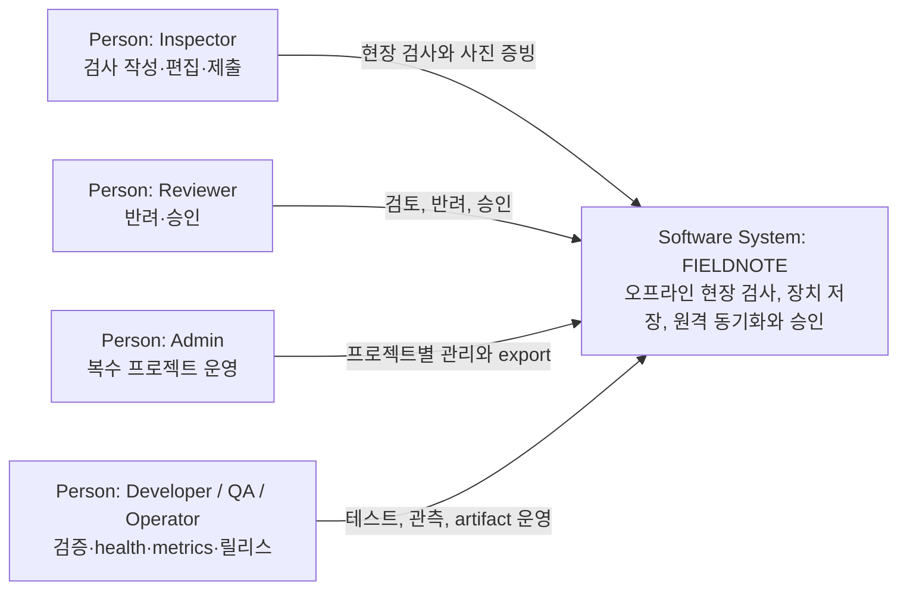

이 수준에서 FIELDNOTE는 Angular PWA와 companion API를 합친 하나의 software system이다. 외부 IdP, object storage, managed database와 monitoring platform은 아직 연결되지 않았으므로 현재 컨텍스트에 실선 시스템으로 넣지 않는다.

### 3.2 시스템 범위

**범위 안**

- Angular PWA, Service Worker와 browser persistence
- Node companion API, demo authentication/RBAC와 JSON state file
- client/server build, 자동 테스트, checksum artifact pipeline
- 로컬·서버 audit, CSV, health와 Prometheus metrics endpoint

**범위 밖 또는 미구현**

- 실제 조직 identity lifecycle과 production authorization source
- remote photo binary 저장·배포
- managed DB, message broker와 multi-instance 운영
- production network, TLS termination, WAF, secret store, observability backend
- 실제 staging/production promotion과 rollback executor

### 3.3 기술 인터페이스

| 인터페이스 | 발신자 → 수신자 | 계약 |
| --- | --- | --- |
| Browser UI | 사람 → Angular PWA | `/dashboard`, `/inspections`, `/inspections/:id`, `/templates`, `/audit-log`, `/settings`, `/help` |
| Sync API | PWA → companion API | Bearer + JSON, `POST /v1/projects/:projectId/sync/batch`, operation별 `acked/conflict/rejected` |
| Inspection API | PWA 또는 API 소비자 → companion API | PWA는 conflict snapshot `GET`을 사용한다. direct list/create/update/delete/transition/audit/export는 구현·테스트된 API 소비자용 계약이며 현재 PWA mutation은 batch만 사용한다. |
| Health | 운영 도구 → API | 공개 `GET /health` 또는 `/healthz`; liveness와 build version |
| Metrics | collector/운영 도구 → API | 공개 `GET /metrics`; Prometheus text, 현재 ACL 없음 |
| Browser persistence | PWA → browser | IndexedDB 3개, localStorage, sessionStorage, Cache Storage |
| Server persistence | companion API → file system | version 1 JSON snapshot, temp file `fsync` 후 atomic rename |
| Artifact | GitHub Actions → artifact store | client/server directory와 SHA-256 manifest, 14일 보존 |

정확한 HTTP 계약과 환경 변수는 [Companion API 문서](../../server/README.md)를 참조한다.

## 4. 솔루션 전략

| 품질 목표 | 핵심 전략 | 트레이드오프 |
| --- | --- | --- |
| 데이터 유실 방지 | browser에 먼저 저장하고 IndexedDB transaction 완료를 await한다. hydrate 중 mutation과 검사별 write 순서를 보존한다. | inspection, photo와 outbox가 다른 DB이므로 전체 mutation은 원자적이지 않다. |
| 정직한 상태 | `localSaveStatus`와 `syncStatus`를 독립 축으로 유지한다. | UI와 복구 로직이 복잡해지고 모든 예외 경로가 두 상태를 함께 관리해야 한다. |
| 오프라인 가용성 | PWA app shell과 IndexedDB/Cache Storage를 사용한다. | update/downgrade, quota와 browser matrix 관리가 필요하다. |
| 원격 일관성 | actor-bound durable outbox, idempotency key, optimistic revision과 ACK-before-remove를 사용한다. | cross-DB crash window와 operation 축적을 별도 reconciliation으로 보완해야 한다. |
| 충돌 안전성 | 자동 덮어쓰기·merge를 하지 않고 queue를 멈춘 뒤 사용자 선택으로 server version을 적용한다. | local version을 재적용하거나 field merge하는 경로가 없어 사용자가 편집을 포기해야 완료된다. |
| 권한 보호 | client는 UX를 제한하고 server가 membership, permission, workflow와 SoD를 재검증한다. | 현재 token이 bundle에 있는 demo 값이므로 production identity는 아니다. |
| 단순한 서버 | thin HTTP adapter → service/domain → injected transactional storage 계층을 Node 내장 모듈로 구현한다. | JSON 전체 rewrite, 단일 프로세스와 schema migration 부재로 확장성이 제한된다. |
| 재현 가능한 릴리스 | typecheck, unit/integration, E2E, build와 artifact checksum을 한 gate로 묶는다. | checksum은 서명·provenance가 아니며 실제 배포 승격은 아직 수동/미구현이다. |

## 5. 빌딩 블록 뷰

### 5.1 C4 Level 2 — Container View

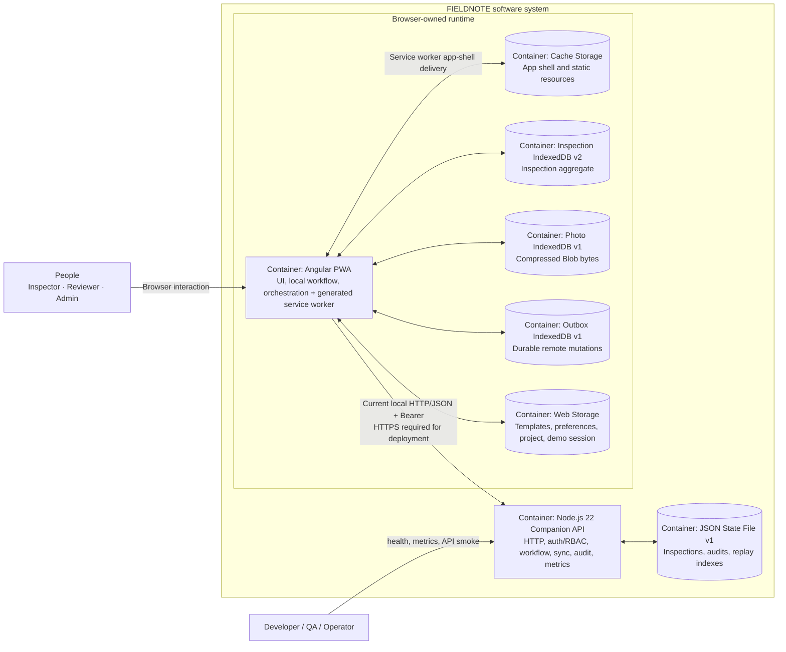

Container의 데이터 권위는 다음처럼 구분한다.

| 데이터 | 현재 권위 | 비고 |
| --- | --- | --- |
| 장치 draft와 local save 상태 | Inspection IndexedDB | offline 편집의 장치 복원 source |
| 사진 binary | Photo IndexedDB | 서버에는 metadata/checksum만 전송 |
| 미전송 mutation | Outbox IndexedDB | 원 actor, 순서, retry 정보를 보존 |
| template/version | localStorage | project/identity 공용 origin 범위; 서버 보존 없음 |
| 원격 inspection/revision | Companion API JSON state | 공유 상태와 conflict 복구 source |
| 권위 audit | Companion API JSON state | UI audit 화면은 현재 장치 local audit 중심 |
| static shell | Service Worker Cache Storage | API 응답은 cache 대상이 아님 |

### 5.2 C4 Level 3 — Angular PWA Component View

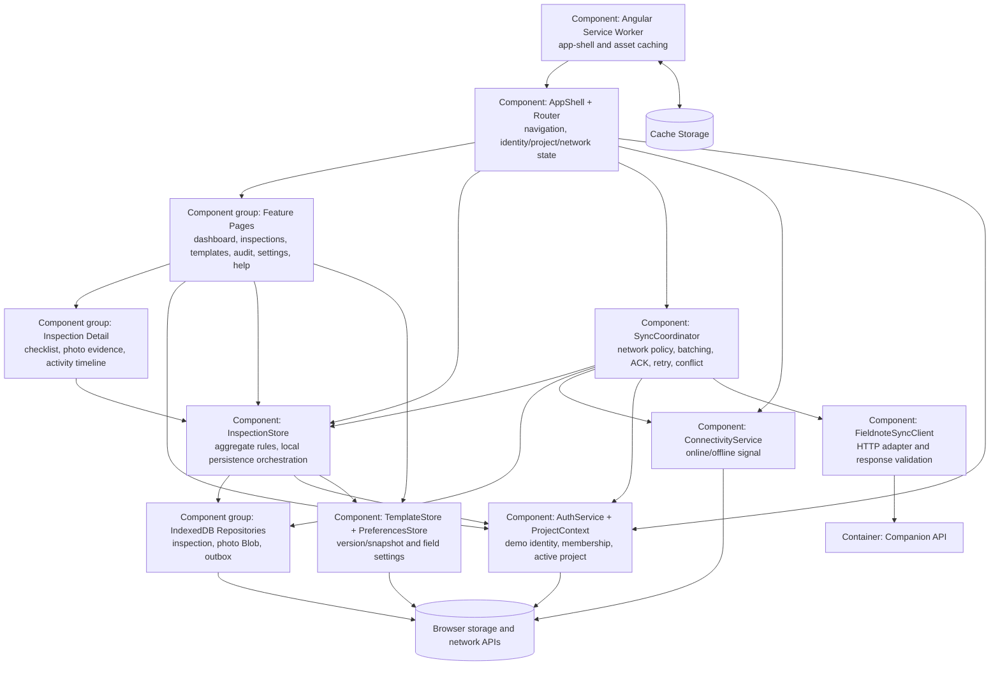

| Component | 책임 | 주요 코드 |
| --- | --- | --- |
| AppShell/Router | lazy route, profile/project 전환, 전역 sync/storage 상태 | `src/app/layout/app-shell`, `src/app/app.routes.ts` |
| Feature pages | 사용자 사례와 form/dialog orchestration | `src/app/features` |
| InspectionStore | aggregate rule, workflow, 사진 metadata, local write와 outbox 생성 | `src/app/core/state/inspection.store.ts` |
| TemplateStore | draft/publish/version과 검사 생성 시 snapshot | `src/app/core/state/template.store.ts` |
| Auth/ProjectContext | demo identity와 project membership 필터 | `src/app/core/auth`, `src/app/core/state/project-context.service.ts` |
| Repositories | IndexedDB schema, transaction, validation, quarantine, quota | `src/app/core/data`, `src/app/core/sync/indexed-db-outbox.repository.ts` |
| SyncCoordinator | actor grouping, 최대 100개 batch, retry, ACK와 conflict recovery | `src/app/core/sync/sync-coordinator.service.ts` |
| FieldnoteSyncClient | API endpoint, timeout, request/response validation | `src/app/core/sync/fieldnote-sync-client.ts` |

### 5.3 C4 Level 3 — Companion API Component View

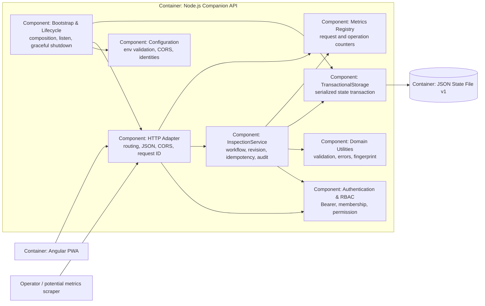

| Component | 책임 | 주요 코드 |
| --- | --- | --- |
| Bootstrap/Lifecycle | config와 adapter 조립, SIGTERM/SIGINT, 최대 10초 graceful shutdown | `server/index.mjs` |
| HTTP Adapter | route, batch envelope/iteration, JSON body limit, CORS, request ID, no-store application response | `server/src/http.mjs` |
| Auth/RBAC | constant-time token 비교, project membership와 role permission | `server/src/auth.mjs` |
| InspectionService | 단일 create/update/delete/transition operation, revision, idempotency와 audit | `server/src/service.mjs` |
| Domain | error shape, canonical fingerprint, UUID 생성, ID 형식과 timestamp validation | `server/src/domain.mjs` |
| TransactionalStorage | process 내부 mutation 직렬화, memory/file adapter | `server/src/storage.mjs` |
| Metrics | normalized route count/latency sum과 operation result count | `server/src/metrics.mjs` |

### 5.4 UML Domain Model

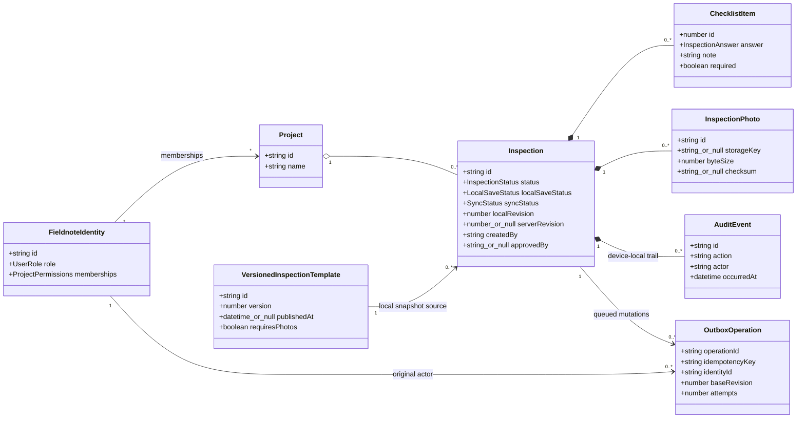

Client `Inspection`은 local status, template version과 사진 storage 정보를 포함하는 확장 aggregate다. 서버 record는 공유 workflow에 필요한 subset만 보존한다. 특히 `templateVersion`, `templatePublishedAt`, `templateSnapshotAt`은 현재 sync payload와 서버 allowlist에 없어 서버 권위 기록이 아니다.

### 5.5 Source tree mapping

```text
src/app
├── core
│   ├── auth       demo identity and project permissions
│   ├── data       inspection/photo IndexedDB adapters
│   ├── models     client domain types
│   ├── services   connectivity and toast
│   ├── state      inspection/template/project/preferences stores
│   └── sync       outbox, HTTP client, sync coordinator
├── features       lazy user-facing workflows
├── layout         application shell
└── shared/ui      status badge and toast

server
├── index.mjs      composition and lifecycle
├── src            HTTP, auth, service/domain, metrics, storage
└── test           Node API/config/storage integration tests

e2e                production-artifact Playwright scenarios
scripts            preview, coverage and artifact gates
docs               workflow, roadmap, runbook and architecture
```

## 6. 런타임 뷰

### 6.1 시작과 hydration

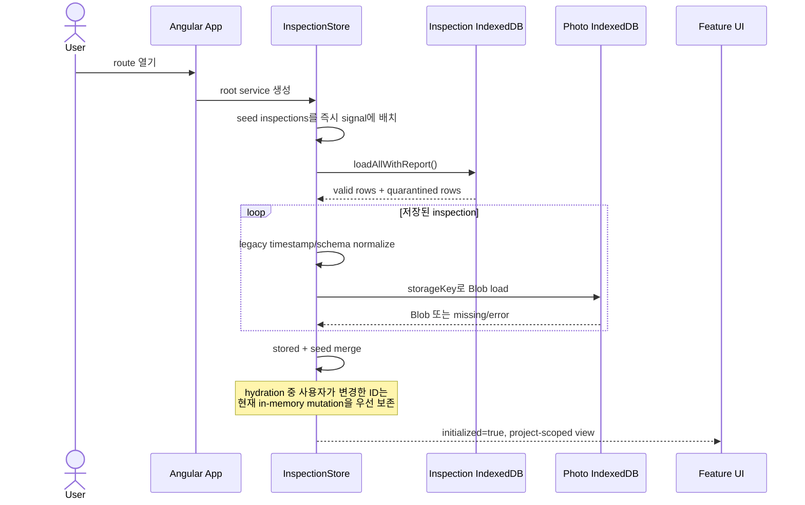

저장 DB를 읽지 못하면 seed data로 화면은 계속 열리고 오류는 `InspectionStore.storageError` signal에 기록된다. 그러나 이 초기 load 오류 signal은 현재 UI에 연결되지 않아 사용자가 원인을 보지 못한다. malformed row는 전체 load를 실패시키지 않고 quarantine report로 분리한다. 다만 seed가 항상 production bundle과 초기 state에 포함되는 점은 Production 차단 항목이다.

### 6.2 업무·저장·동기화 상태

업무 상태:

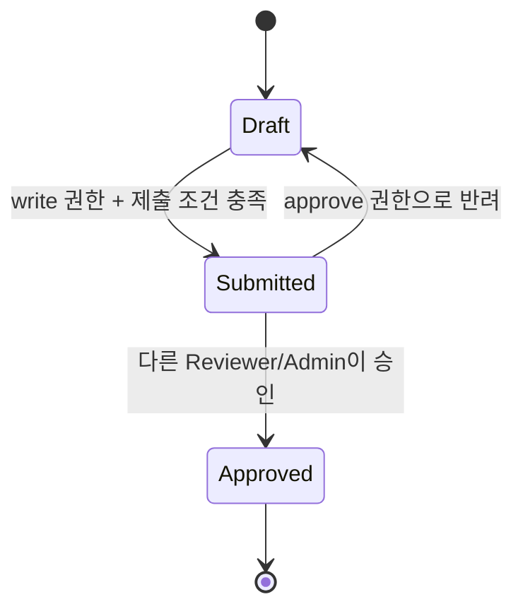

`Draft`만 수정·삭제할 수 있으며 `Submitted`와 `Approved`는 잠긴다. 제출 조건은 실제 zone, 모든 필수 답변, fail 항목별 조치 note, `requiresPhotos=true`일 때 최소 한 개 사진 metadata다.

장치 저장 상태:

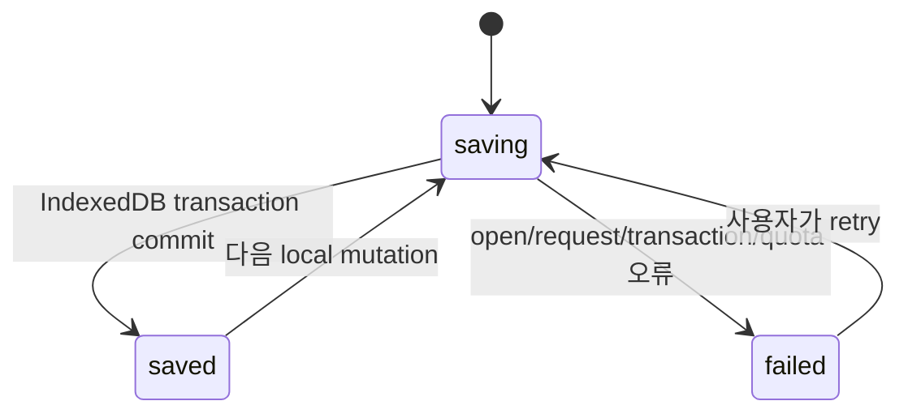

원격 동기화 상태:

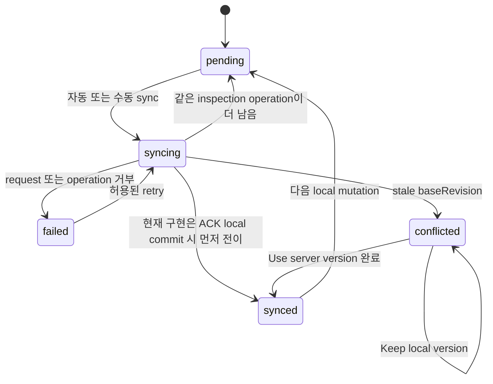

세 상태 기계는 독립적이다. 예를 들어 `localSaveStatus=saved`와 `syncStatus=pending`은 정상적인 offline 상태다.

### 6.3 Offline mutation에서 server ACK까지

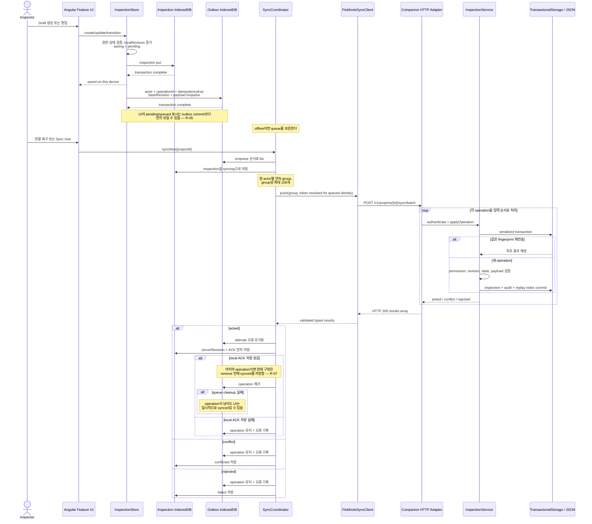

자동 retry는 network, timeout, invalid response, HTTP 408/429/5xx에만 적용한다. 401/403/422 등 영구 오류와 operation-level rejection은 자동 반복하지 않는다. 원 identity를 찾을 수 없는 queued operation도 전송하지 않고 failed로 남긴다. Background Sync API는 사용하지 않으므로 앱이 열려 있어야 coordinator가 동작한다.

### 6.4 Revision conflict 복구

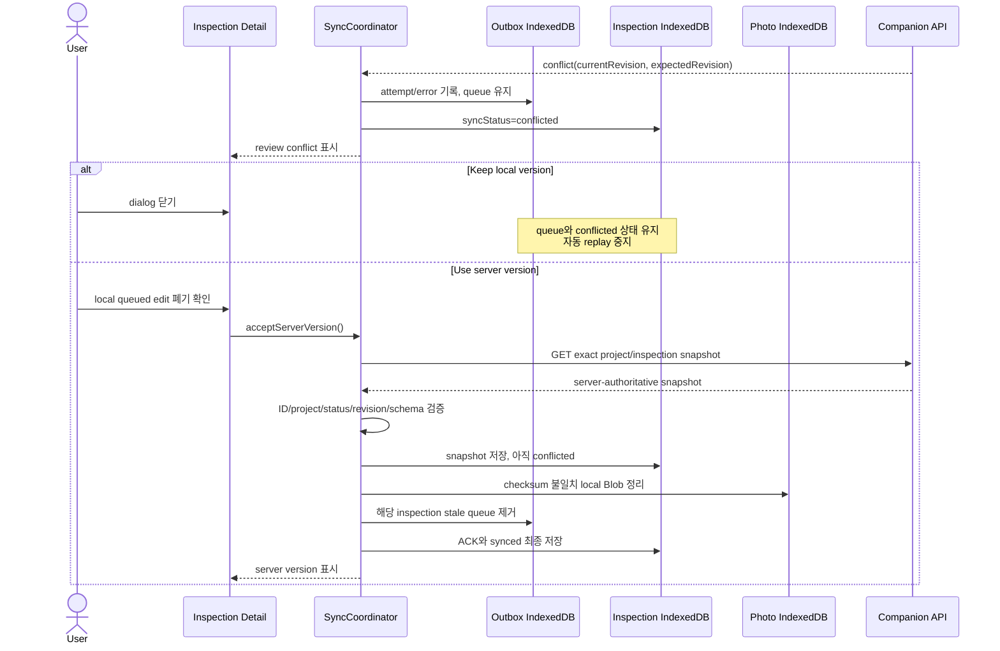

이 흐름은 자동 덮어쓰기를 막지만 세 IndexedDB 사이에서 원자적이지 않다. snapshot 저장, queue 삭제, 최종 ACK 사이 crash/failure 복구는 위험 R-06에 기록한다.

### 6.5 사진 증빙 저장

1. UI가 MIME type과 최대 10 MiB 입력을 검증한다.
2. Canvas가 이미지를 최대 1920 px로 축소·압축한다.
3. `InspectionStore`가 SHA-256을 계산하고 Photo IndexedDB에 Blob을 저장한다.
4. inspection metadata에 `storageKey`, byte size, checksum과 capture metadata를 저장한다.
5. metadata 저장 실패가 정상적으로 반환되면 방금 만든 Blob을 보상 삭제한다.
6. sync payload에는 metadata/checksum만 포함되며 binary는 포함되지 않는다.

프로세스가 두 DB commit 사이에 종료되는 crash window와 orphan cleanup 부재는 별도 기술부채다.

## 7. 배포 뷰

### 7.1 Current — local development and verification

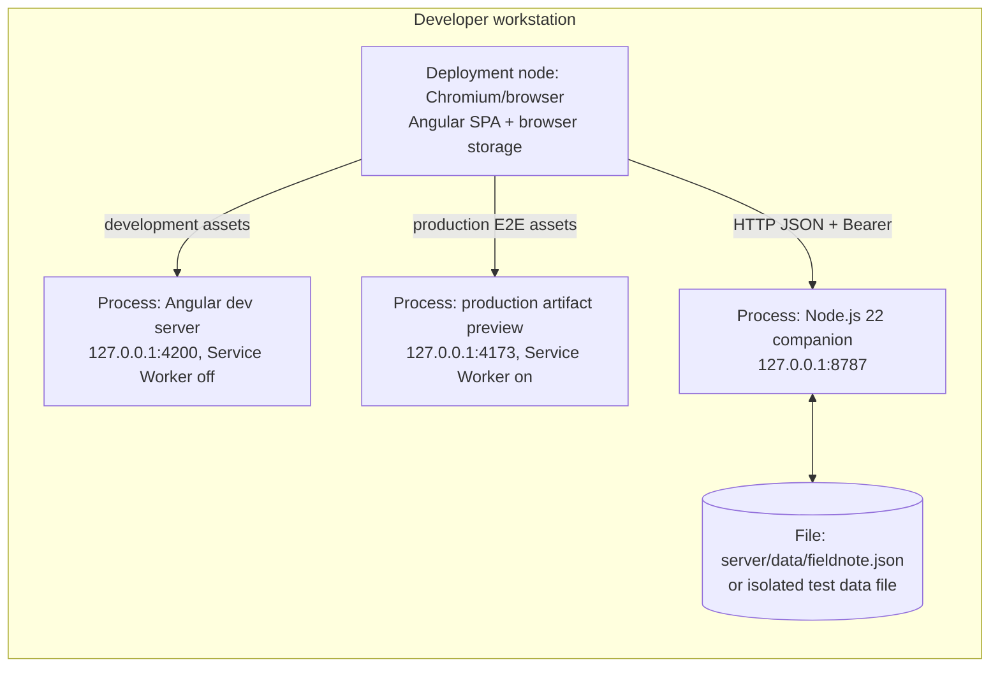

개발에서는 `npm run server:start`와 `npm run start`를 별도 터미널에서 실행한다. production-like 검증은 `npm run build`, `npm run preview`, companion server와 Playwright Chromium을 사용한다.

### 7.2 Current — CI artifact pipeline

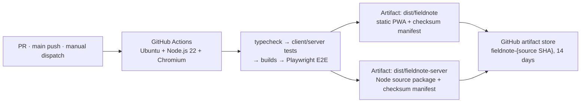

`npm run verify`는 typecheck, client/server test, production builds, E2E와 두 artifact checksum 검증을 수행한다. checksum manifest는 무결성 검사이지 서명이나 공급망 provenance가 아니다. release 후보는 반드시 clean committed HEAD에서 다시 생성하고 `sourceSha`를 확인해야 한다. README에 기록된 hash는 과거 로컬 증거이며 현재 commit의 배포 승인으로 재사용할 수 없다.

### 7.3 Planned — production target, not implemented

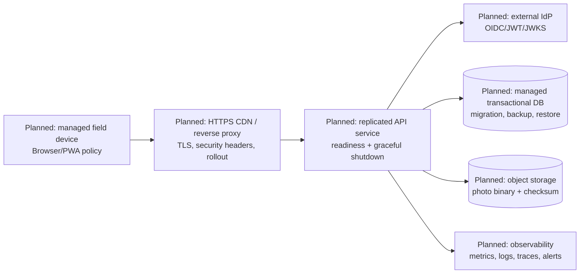

이 그림은 목표 방향이며 현재 배포를 나타내지 않는다. provider, topology, replica 수, RPO/RTO와 SLO는 아직 결정되지 않았다. 실제 전환 전 [릴리스 런북](../release-runbook.md)의 hard gate를 만족해야 한다.

### 7.4 배포·rollback 제약

- Client artifact: `dist/fieldnote`
- Server artifact: `dist/fieldnote-server`
- Server package는 transpile/bundle 없이 `index.mjs`, `src`, README를 복사한다.
- graceful shutdown은 새 연결을 닫고 최대 10초 후 강제 종료한다.
- JSON backup은 정상 종료 후 파일을 복사해야 한다.
- rollback은 이전 artifact와 storage schema 호환성을 먼저 확인한다.
- IndexedDB v2에서 구버전 client로 내리는 downgrade는 `VersionError`가 날 수 있어 schema-compatible rollback만 허용한다.
- 현재 deploy/canary/rollback job, IaC와 production release record는 없다.

## 8. 횡단 관심사

### 8.1 인증, 권한과 프로젝트 격리

- Client는 UI와 local workflow에서 permission을 검사하지만 신뢰 경계가 아니다.
- Server는 OPTIONS preflight를 제외한 모든 `/v1` 업무 요청에서 Bearer, membership, permission과 role을 재검증한다.
- token 비교에는 `timingSafeEqual`을 사용한다.
- 동일 작성자는 Admin이어도 자기 검사를 승인할 수 없다.
- project ID는 URL, payload, membership과 storage partition에서 교차검증한다.
- 현재 identity/token은 정적 demo 값이고 sessionStorage selector는 sign-in이 아니다.

### 8.2 데이터 일관성과 revision

- `localRevision`은 장치 mutation 순서를, `serverRevision`은 원격 권위 version을 나타낸다.
- create는 `baseRevision=0`; 이후 operation은 projected server revision을 사용한다.
- idempotency fingerprint는 kind, inspection ID, base revision과 payload의 canonical SHA-256이다.
- idempotency 범위는 identity + project + key다.
- Server transaction은 inspection, audit와 replay index를 한 상태 commit으로 묶는다.
- Batch는 전체 원자 transaction이 아니라 operation별 순차 transaction이다.

### 8.3 로컬 영속성과 migration

- inspection v2 repository는 유효 행만 load하고 손상 행을 quarantine한다.
- legacy 상대 날짜와 inline data URL 사진을 normalize/migrate한다.
- 검사별 Promise queue가 오래된 write completion이 최신 edit를 saved로 표시하지 못하게 한다.
- 사진, inspection과 outbox는 책임·quota 분리를 위해 서로 다른 DB에 있지만 cross-DB transaction은 없다.
- quarantine을 사용자가 export/복구/삭제하는 UI는 없다.

### 8.4 오류와 사용자 상태

- IndexedDB open/request/transaction/abort/quota 오류를 호출자에게 전달한다.
- Client는 storage/sync 오류를 signal과 상태에 기록하고 local/remote 상태를 분리한다. mutation 실패 일부는 상태·toast로 보이지만 inspection 초기 load 오류 signal은 현재 UI에 연결되지 않았다.
- Server는 `{error:{code,message,details?}, requestId}` 형식을 사용한다.
- JSON/text application response는 `Cache-Control: no-store`, `X-Request-Id`를 가진다. OPTIONS 204는 `X-Request-Id`만 설정한다.
- mutation 이전의 인증·라우팅·파싱 오류는 `{error:{code,message,details?}, requestId}` envelope을 사용하고, mutation business 결과는 operation 정보와 `acked/conflict/rejected`를 사용한다.
- invalid content type, body limit, path encoding과 CORS origin을 경계에서 거부한다.

### 8.5 감사와 export

- Client `auditTrail`은 장치-local UX 이력이며 사용자가 저장소를 수정할 수 있다.
- Server audit는 actor, timestamp와 revision을 서버가 작성하고 성공/거부 mutation을 기록한다.
- server audit와 전역 security audit의 보존·조회·tamper evidence 정책은 완성되지 않았다.
- CSV는 모든 셀을 quote하고 `=`, `+`, `-`, `@`로 시작하는 값을 escape한다.
- UI export는 local inspection snapshot, API export는 server project snapshot이므로 서로 다른 결과가 가능하다.

### 8.6 사진 보안과 privacy

- JPEG/PNG/WebP만 수용하고 size·project quota를 검사한다.
- binary는 장치 browser profile에 평문 Blob으로 저장된다.
- 위치 정보는 수집하지 않음을 UI에 표시하고 선택적 metadata 설정을 제공한다.
- 원격에는 metadata/checksum만 있어 다른 장치에서 binary를 복원할 수 없다.
- device encryption, retention, remote wipe와 object-storage access policy는 미구현이다.

### 8.7 PWA와 cache

- production app shell은 prefetch하고 asset은 lazy cache한다.
- API 응답은 Angular Service Worker cache에 포함하지 않는다.
- preview server는 shell/manifest/worker 등 5개 파일을 revalidate하고 그 밖의 파일은 1년 immutable로 제공한다. JS/CSS chunk는 content-hashed지만 favicon과 일부 복사 asset은 stable filename이라 cache invalidation 위험이 있다.
- update 적용·유예 UX와 schema downgrade 정책은 완성되지 않았다.

### 8.8 관측성과 운영

- `/healthz`는 process liveness, version, storage mode와 timestamp를 제공하지만 storage readiness는 검사하지 않는다.
- `/metrics`는 uptime, normalized route request count/latency sum-count와 operation result를 process memory에서 제공한다.
- metric은 재시작 시 초기화되고 histogram, collector, dashboard와 alert가 없다.
- start/stop/5xx는 JSON log지만 정상 access log, trace와 중앙 수집은 없다.
- production에서는 health/metrics를 reverse proxy나 monitoring network로 제한해야 한다.

### 8.9 접근성, 반응형과 국제화

- new inspection dialog는 focus 복귀를 구현하고, 초기 focus, focus trap과 Escape reason을 자동 test한다.
- checklist 선택은 label과 `aria-pressed`로 전달한다.
- inspection register에서 axe serious/critical 0건과 390×844 horizontal overflow 부재를 test한다.
- 검증 범위는 일부 화면과 Chromium에 제한된다.
- 저장 시간은 ISO, 표시는 `en-AU` locale을 사용한다.

### 8.10 품질 gate와 artifact integrity

- client/core statements, branches, functions, lines 각각 80% 이상을 요구한다.
- `src/app/core` runtime TypeScript 전 파일의 계측을 강제한다.
- server lines/branches/functions 각각 80% 이상을 요구한다.
- production artifact를 대상으로 Playwright를 실행한다.
- client/server artifact는 파일별·aggregate SHA-256 manifest를 생성하고 재검증한다.
- verifier는 manifest에 열거된 파일만 확인하며 추가 파일, 서명과 `sourceSha===HEAD`는 자동 보장하지 않는다.

## 9. 아키텍처 결정

현재 별도 ADR 파일은 없다. 아래 decision record가 현행 설계의 기준이며, 큰 변경 시 ADR 파일로 분리한다.

| ID | 상태 | 결정과 이유 | 결과·교체 조건 |
| --- | --- | --- | --- |
| AD-001 | Accepted | 연결보다 장치 저장을 우선하는 local-first PWA와 IndexedDB를 사용한다. | offline 가용성을 얻지만 migration, quota, device security 책임이 생긴다. |
| AD-002 | Accepted | local save와 remote sync 상태를 별도 축으로 모델링한다. | 사용자에게 정확하지만 모든 예외 경로에서 두 상태를 함께 검증해야 한다. |
| AD-003 | Provisional | inspection, photo와 outbox를 세 IndexedDB로 분리한다. | schema와 quota가 분리되지만 cross-DB atomicity가 없다. reconciliation 도입 또는 단일 DB 재평가 시 교체한다. |
| AD-004 | Accepted | outbox가 원 actor, operation ID, idempotency key와 base revision을 보존하고 ACK local commit 후 제거한다. | session switch와 retry에 안전하다. queue retention/reconciliation이 필요하다. |
| AD-005 | Accepted | optimistic revision 충돌은 자동 merge하지 않고 사용자 확인 후 server version으로 복구한다. | 자동 데이터 덮어쓰기를 막지만 local rebase/merge가 없다. |
| AD-006 | Accepted | Angular standalone component, signals, lazy route와 OnPush를 사용한다. | feature 경계와 client 반응성을 단순화한다. |
| AD-007 | Provisional | server는 Node 내장 모듈과 injected `TransactionalStorage`를 사용한다. | runtime dependency가 작고 테스트하기 쉽다. managed DB adapter 전환 시 service/API test를 보존한다. |
| AD-008 | Temporary | 단일 JSON file adapter로 로컬 통합을 제공한다. | multi-instance, 대용량, migration과 crash durability 요구 전 반드시 교체한다. |
| AD-009 | Temporary | client/server에 동일 demo membership과 token을 둔다. | UX와 API 권한 test에는 유용하지만 외부 IdP 도입 즉시 제거한다. |
| AD-010 | Temporary | 사진은 local Blob, server에는 metadata/checksum만 저장한다. | offline 증빙을 보존하지만 공유·복구가 불가능하다. binary upload 도입 시 상태 모델도 확장한다. |
| AD-011 | Accepted | client와 server가 업무 상태·권한을 각각 검증한다. | client는 빠른 안내, server는 권위 enforcement를 담당한다. |
| AD-012 | Accepted | client/server artifact를 분리하고 SHA-256 manifest와 quality gate를 사용한다. | 승격 가능성을 높이지만 signing/provenance와 실제 deploy는 추가해야 한다. |
| AD-013 | Provisional | 게시 템플릿을 검사 생성 시 local snapshot으로 고정한다. | 이후 template 변경에서 검사를 보호하지만 version metadata가 서버에는 전송되지 않는다. |

## 10. 품질 요구사항

arc42 권장 방식대로 품질 요구를 자극, 환경, 응답과 측정값이 있는 시나리오로 표현한다. `PASS`는 저장소에 자동 증거가 있음을, `PARTIAL`은 범위가 제한됨을, `OPEN`은 목표 또는 측정값이 미완성임을 뜻한다.

### 10.1 품질 개요

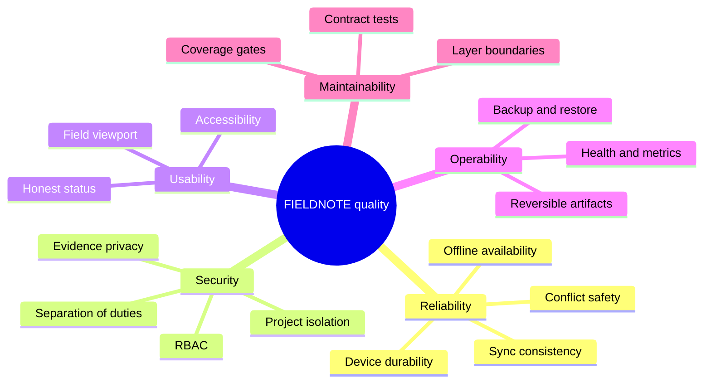

### 10.2 품질 시나리오

| ID | 품질 | Source / Stimulus | 환경·대상 | 기대 응답과 측정값 | 자동 증거 | 판정 |
| --- | --- | --- | --- | --- | --- | --- |
| REL-01 | Local durability | Inspector가 network 단절 중 검사 변경 | InspectionStore + IndexedDB | transaction commit 후에만 `saved`; 실패는 `failed`; reload 후 record 복원 | `indexed-db.repository.spec.ts`, `inspection.store.spec.ts`, `core-workflow.spec.ts` | PASS |
| REL-02 | Offline availability | 사용자가 online에서 만든 local deep link를 새 offline tab에서 연다 | production Service Worker + IndexedDB | cached shell이 열리고 같은 inspection을 표시 | `e2e/routes-and-offline.spec.ts` | PASS, Chromium |
| REL-03 | Sync consistency | 연결 복구 후 queued create를 보낸다 | outbox, coordinator, companion API | remote ACK 전 queue 1/remote 404; ACK local commit 뒤 queue 0, revision 1, `synced` | `e2e/offline-sync.spec.ts` | PASS |
| REL-04 | ACK failure safety | 서버 ACK 뒤 장치 ACK 저장이 실패한다 | coordinator + inspection/outbox DB | operation을 제거하지 않고 오류와 queue를 보존 | `sync-coordinator.service.spec.ts` | PASS |
| REL-05 | Conflict safety | stale `baseRevision` operation을 보낸다 | client/server sync | `conflicted`, queue 보존, 사용자 선택 전 replay 0; 선택 후 정확한 snapshot과 revision 적용 | `e2e/offline-sync.spec.ts`, server API test | PASS |
| SEC-01 | Project isolation | 사용자가 membership 없는 project list/deep link/API/CSV를 요청 | UI, store, server | UI 미노출/Not found, API 403, 타 project data 0건 | `e2e/project-isolation.spec.ts`, `server/test/api.test.mjs` | PASS |
| SEC-02 | Separation of duties | inspection 작성자가 승인한다 | client/server workflow | UI가 허용하지 않고 server는 403; 다른 Reviewer/Admin만 승인 | `e2e/core-workflow.spec.ts`, server API test | PASS |
| DATA-01 | Photo integrity | 사용자 입력이 type/size/quota를 위반하거나 metadata save가 실패 | photo UI + Blob repository | type/size 거부, 5 MiB/100 MiB gate, 실패 시 metadata 불변과 보상 삭제 | photo component/repository/store specs | PASS |
| UX-01 | Accessibility | 키보드/자동 검사로 register와 new dialog를 사용 | Chromium, 390×844 포함 | axe serious/critical 0, focus trap/Escape, horizontal overflow 0 | `routes-and-offline.spec.ts`, dialog/checklist specs | PARTIAL: 화면·browser 제한 |
| MAINT-01 | Testability | core runtime 파일 또는 server logic을 변경 | CI test gate | client/core 4개 coverage 지표 ≥80%, core runtime 100% 계측; server 3개 지표 ≥80% | `scripts/check-coverage.mjs`, workflow | PASS at recorded baseline |
| RELEASE-01 | Artifact integrity | CI가 한 source SHA를 release 후보로 만든다 | clean committed HEAD | client/server 모든 manifest file hash와 aggregate가 재검증되고 source SHA가 후보 commit과 일치 | artifact scripts + runbook | PARTIAL: signing/deploy 없음 |
| OPS-01 | Liveness | 운영 도구가 `/healthz`를 호출 | running companion process | cheap 200 JSON에 version/storage/timestamp | server API test | PASS for liveness, no readiness |
| PERF-01 | Client size | production client build | Angular build | initial bundle ≤1 MiB, component style ≤24 KiB | `angular.json`, `npm run build` | PASS at recorded baseline |
| PERF-02 | Field latency | 장기 데이터·대형 사진·긴 note에서 저장/sync | target devices and supported browsers | save latency, API p95, outbox age가 합의된 SLO 안 | 없음 | OPEN: SLO 미정 |
| CHANGE-01 | Storage replaceability | JSON adapter를 managed DB로 교체 | service/storage boundary | HTTP와 domain API test를 변경 없이 통과하고 migration/rollback test 추가 | injected storage + server tests | OPEN |

저장소의 마지막 기록은 client 205개, server 13개, Playwright 14개 통과와 80% 이상 coverage다. 이는 [README](../../README.md)의 과거 검증 기록이며, release 직전에는 clean HEAD에서 `npm run verify`를 다시 실행해야 한다.

## 11. 위험과 기술부채

### 11.1 우선순위 목록

| ID | 우선순위 | 위험/부채 | 영향 | 권장 완화와 완료 증거 |
| --- | --- | --- | --- | --- |
| R-01 | P0 | demo identity/token과 seed data가 client/server에 포함 | 실제 인증·책임 추적 불가, 운영 데이터 혼입 | 외부 IdP/JWT/JWKS, expiry/revocation/rotation, seed 제거, queued action 재인가 E2E |
| R-02 | P0 | 사진 binary는 장치에만 있고 server에는 metadata만 있음 | 다른 장치 복원·감사 증빙·백업 불가 | signed upload, object storage, checksum, retention, orphan cleanup과 end-to-end 복원 test |
| R-03 | P0 | server가 단일 JSON 전체 rewrite와 process-local lock 사용 | multi-instance race, 대용량 성능, backup/RPO 위험 | managed transaction DB, unique idempotency constraint, migration, backup/restore rehearsal |
| R-04 | P0 | 실제 HTTPS endpoint, staging/prod host, deploy/canary/rollback job 없음 | 검증 artifact를 사용자에게 안전하게 전달할 수 없음 | IaC, secret store, promotion, canary, rollback drill과 release record |
| R-05 | P1 | inspection commit과 outbox enqueue가 서로 다른 DB transaction | commit 직후 crash면 pending local edit에 queue가 없을 수 있음 | startup reconciliation, atomic single-DB design 또는 durable mutation journal + crash test |
| R-06 | P1 | conflict recovery가 snapshot save → outbox delete → final ACK의 cross-DB 흐름 | 마지막 실패 시 queue 없는 `conflicted` snapshot 가능 | recoverable phase marker/saga, idempotent reconciliation과 각 crash point test |
| R-07 | P1 | ACK local 저장 후 outbox remove 실패 시 현재 operation을 제외해 먼저 `synced` 가능 | queue가 남았는데 UI가 일시적으로 원격 완료라고 표시 | remove 성공 전 `pending`, cleanup-pending 상태 또는 transaction/reconciliation test |
| R-08 | P1 | Photo Blob와 inspection metadata commit이 cross-DB | process crash에서 orphan/missing Blob | periodic integrity scan, orphan cleanup, two-phase marker와 crash recovery test |
| R-09 | P1 | template version metadata가 sync payload/server에 없음 | 서버에서 사용된 template version을 증명할 수 없음 | API/schema에 template snapshot identity·version을 추가하고 migration/contract test |
| R-10 | P1 | TemplateStore storage 접근 실패가 보호되지 않음 | private/quota/denied storage에서 template 기능 또는 앱 초기화 실패 | get/set try-catch, error state, quota/denial test |
| R-11 | P1 | server audit UI 미연결, file operator가 audit 수정 가능 | 운영 감사와 device-local 화면이 불일치하고 tamper evidence 없음 | 권위 audit query UI, retention, append-only DB/WORM 또는 hash chain |
| R-12 | P1 | browser/device matrix, 실제 quota exhaustion와 SW update/downgrade 검증 부족 | 지원 장치에서 offline 복구 실패 가능 | 지원표, Safari/iOS/Android/tablet matrix, quota와 schema rollout drill |
| R-13 | P2 | Background Sync가 없고 Wi-Fi-only가 Network Information API 부재 시 전송 허용 | 앱이 닫히면 queue 지연, 정책 의미가 best-effort | 명확한 UX, supported API 정책, background worker 또는 foreground-only SLO |
| R-14 | P2 | note 입력마다 local write, audit와 outbox operation 생성 | 긴 입력에서 성능·queue/audit 증가 | debounce/coalesce 정책과 장기 입력 성능 test |
| R-15 | P2 | `/metrics` 공개, no readiness/collector/dashboard/alert/access log | 장애 탐지·원인 분석 미흡 | protected scrape path, `/readyz`, OpenTelemetry/collector, SLO alert와 runbook |
| R-16 | P2 | OpenAPI/공유 schema 없이 계약이 README, TS type, validation code에 분산 | client/server drift 위험 | OpenAPI 3.1 또는 code-derived schema, compatibility CI |
| R-17 | P2 | artifact manifest는 extra file, 서명, provenance와 HEAD 일치를 자동 검증하지 않음 | 잘못된 artifact 승격 가능 | clean extraction, sourceSha gate, signed provenance/SBOM과 장기 release record |
| R-18 | P2 | API delete는 구현됐지만 client action/UI가 없음 | 제품 capability와 API capability가 다르게 이해될 수 있음 | 요구사항 결정 후 UI+outbox 구현 또는 공개 API 범위에서 제거/표시 |
| R-19 | P1 | inspection 초기 load 오류가 signal에만 남고 UI에 연결되지 않음 | 저장 데이터 대신 seed fallback을 본 사용자가 데이터 유실로 오인할 수 있음 | blocking/non-blocking 복구 안내, retry/export 경로와 load-failure E2E |
| R-20 | P2 | preview가 stable-name copied asset도 immutable cache로 제공 | 동일 URL의 asset 교체가 client cache에 반영되지 않을 수 있음 | 모든 장기 cache asset content hashing 또는 stable asset revalidation test |

### 11.2 알려진 운영 한계

- `/healthz`는 storage read/write와 disk 여유를 확인하지 않는 liveness다.
- server metric은 재시작 시 초기화되며 latency histogram이 아니라 sum/count다.
- idempotency index와 audit retention/compaction 정책이 없어 상태 파일이 계속 증가한다.
- file adapter는 file `fsync`와 atomic rename을 사용하지만 directory `fsync`는 없어 강제 전원 장애 durability를 완전히 보장하지 않는다.
- server storage migration은 없고 version 1 외에는 시작을 거부한다.
- UI local CSV와 server CSV는 서로 다른 snapshot을 export할 수 있다.
- conflict 완료 경로는 server version 수용뿐이며 local rebase/field merge는 없다.
- quarantine row의 사용자 복구 UI와 service worker update UX가 없다.

우선순위와 단계별 완료 기준은 [유지보수 로드맵](../maintenance-roadmap.md), 운영 대응은 [릴리스 런북](../release-runbook.md)에 연결한다.

## 12. 용어집

| 용어 | 정의 |
| --- | --- |
| ACK | Server가 operation을 commit하고 revision/timestamp를 돌려준 확인 결과. 장치에 저장된 뒤에만 queue 제거를 시도한다. |
| App shell | 연결 없이도 UI를 시작하기 위해 Service Worker가 cache한 HTML/JS/CSS 정적 골격. |
| C4 Container | 독립 실행 애플리케이션 또는 데이터 저장소. Docker container에 한정되지 않는다. |
| Cold start | 이미 열린 앱이 아니라 새 tab/process가 cache와 local data로 시작하는 상황. |
| Companion API | local-first PWA의 공유 상태, 권한, revision, audit와 sync ACK를 제공하는 Node 서비스. |
| Conflict | operation의 `baseRevision`과 server current revision이 달라 적용하지 않은 상태. |
| Device save | browser 영속 저장소에 inspection/photo가 commit된 상태. remote sync와 독립적이다. |
| Durable outbox | 전송 전·실패 후에도 IndexedDB에 남는 remote mutation queue. |
| Idempotency key | 같은 actor/project의 동일 mutation 재전송이 중복 효과를 내지 않게 하는 키. |
| Inspection | project에 속하고 checklist, photo metadata, workflow와 audit를 가진 aggregate root. |
| Local integration | 하나의 workstation에서 browser PWA와 companion API를 함께 검증한 상태. hosted production을 뜻하지 않는다. |
| Local revision | 장치에서 mutation 순서를 구분하는 증가 값. server concurrency version과 다르다. |
| Optimistic concurrency | lock 대신 base revision을 비교해 stale mutation을 conflict로 거부하는 방식. |
| Project membership | identity가 project별로 가진 read/write/export/approve permission 집합. |
| Quarantine | 손상된 IndexedDB row가 전체 load를 막지 않도록 제외하고 원인 정보를 보존한 상태. |
| Remote sync | durable outbox operation을 companion API에 보내 server ACK/revision을 장치에 반영하는 과정. |
| Server revision | companion API가 성공 mutation마다 증가시키는 공유 record version. |
| SoD | Separation of Duties. 검사 작성자와 승인자를 분리하는 통제. |
| Template snapshot | 검사 생성 시점의 게시 checklist와 local template version 정보. 현재 server에는 version metadata가 없다. |
| Immutable artifact | 검증 후 파일 내용이 바뀌지 않는 client/server build directory와 checksum manifest. |
| Production NO-GO | 핵심 로컬 흐름은 검증됐지만 운영 hard gate가 남아 배포 승인할 수 없는 판정. |

## 문서 근거와 함께 읽을 자료

- 실행·최근 검증 기록: [Repository README](../../README.md)
- 사용자 사례와 테스트 traceability: [제품 워크플로우 및 검증](../product-workflows-and-verification.md)
- 다음 구현 우선순위: [유지보수 로드맵](../maintenance-roadmap.md)
- 배포·백업·복구: [릴리스 런북](../release-runbook.md)
- API·환경 변수: [Companion API 문서](../../server/README.md)
- 구조의 직접 근거: `src/app/core`, `src/app/features`, `server/src`, `e2e`, `.github/workflows/quality.yml`
