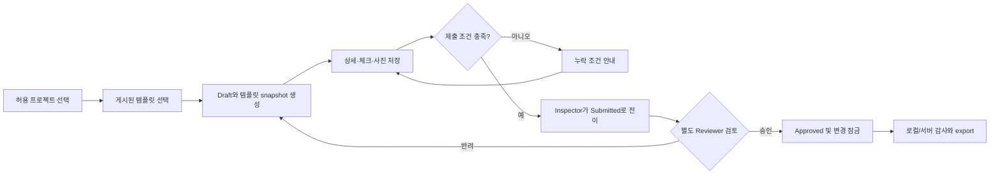
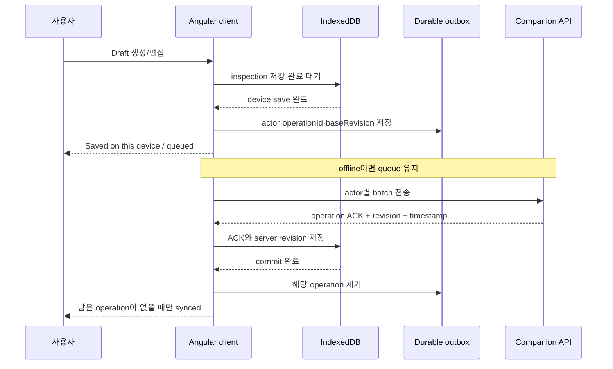
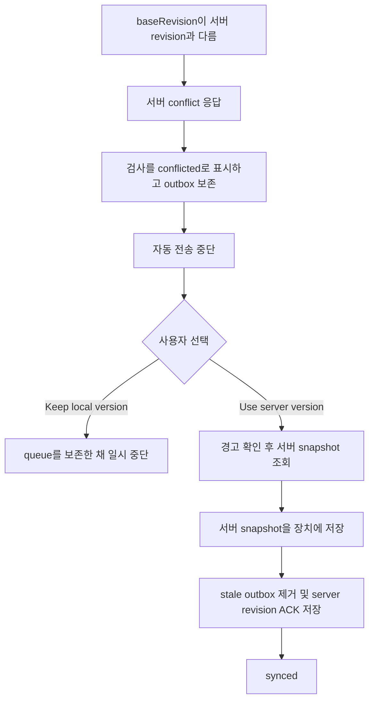

# FIELDNOTE 제품 워크플로우 및 현행 검증

검증 기준: 2026-09-02 현재 작업 트리
대상: Angular 20.3 client와 Node.js 22 companion service
로컬 통합 주소: client `http://127.0.0.1:4173`, API `http://127.0.0.1:8787`
릴리스 판정: **Production NO-GO**

## 1. 결론

FIELDNOTE의 핵심 로컬 통합 흐름은 자동화되어 있다. 검사는 프로젝트 범위에서 생성·저장되고, PWA가 cached app shell과 IndexedDB 기록을 offline 새 탭에서 복원한다. 연결이 돌아오면 actor가 보존된 outbox 작업을 companion API에 보내고, server ACK를 장치에 저장한 뒤에만 queue를 지우고 `synced`로 표시한다. revision conflict는 자동 덮어쓰기하지 않으며 사용자가 경고를 확인하고 서버 버전을 명시적으로 선택해야 복구된다.

다만 이 결과는 production readiness를 뜻하지 않는다.

- client에 포함된 선택형 demo identity/token은 실제 인증이 아니다.
- 외부 IdP/JWT, token 만료·폐기·회전과 재인가가 없다.
- 사진은 장치 Blob으로만 저장되고 서버에는 metadata/checksum만 전송된다. 서버 photo binary upload가 없다.
- server는 단일 프로세스 JSON 파일 저장소이며 관리형 database나 다중 인스턴스 잠금이 없다.
- CI는 검증된 artifact를 생성하지만 실제 staging/production hosting, canary와 rollback target이 없다.

따라서 local demo와 companion sync 통합은 검증됐지만 **실제 현장 production 배포는 NO-GO**다.

판정 용어:

- **PASS**: 구현과 실행 증거가 현재 범위의 수용 기준을 충족한다.
- **PARTIAL**: 핵심 경로는 동작하지만 production 계약 일부가 빠졌다.
- **FAIL**: 구현이 수용 기준과 충돌한다.
- **BLOCKED**: 외부 환경이나 제품 결정이 없어 검증할 수 없다.
- **NO-GO**: production 배포를 막는 필수 조건이 남아 있다.

## 2. 현재 신뢰 경계와 역할

| 역할 | 데모 identity | 프로젝트/권한 | 현재 신뢰 수준 |
| --- | --- | --- | --- |
| 현장 검사자 | Henry Kim / `demo-inspector` | C3 read, write, export | client와 API 권한 검증 PASS, 실제 로그인 아님 |
| 검토자 | Rina Park / `demo-reviewer` | C3 read, export, approve/return | 작성자-승인자 분리 PASS, 실제 로그인 아님 |
| 관리자 | Alex Morgan / `demo-admin` | C3, P2, North read/write/export/approve | 프로젝트 운영 테스트용, 실제 관리자 인증 아님 |
| 감사/운영 | 별도 production identity 없음 | server audit/metrics endpoint 존재 | UI는 device-local audit 중심, production 운영 미연결 |

프로필 메뉴는 역할 검증용 demo persona switcher다. 누구나 선택할 수 있고 token도 client bundle에 포함되므로 보안 경계로 사용할 수 없다. Companion API의 RBAC는 이 demo token을 기준으로 동작한다.

## 3. 핵심 업무 워크플로우

### WF-01 검사 수명주기



허용 전이는 `Draft → Submitted`, `Submitted → Draft`, `Submitted → Approved`뿐이다. client Store와 server가 둘 다 전이를 검증하며 Approved는 수정·삭제할 수 없다. Inspector가 제출하고 다른 Reviewer가 승인하는 E2E가 통과했다.

### WF-02 오프라인 저장에서 서버 ACK까지



network/timeout/5xx는 동일 operation을 보존하고 지수 backoff로 재시도한다. 401/403은 자동 재시도를 중단한다. ACK 저장 실패 시 ACKed operation도 queue에서 제거하지 않는다. `autoSync`와 `wifiOnly` 설정이 coordinator 실행 조건에 반영된다.

### WF-03 revision conflict 복구



**Use server version** 경로는 구현·자동화됐다. 이 선택은 queued local edit와 서버에 없는 local photo를 폐기할 수 있음을 UI가 먼저 경고한다. **Keep local version**은 현재 경고를 닫고 queue를 보존할 뿐이며 local rebase, force-push 또는 field-level merge는 구현되지 않았다.

### WF-04 프로젝트와 권한

1. demo identity의 membership에 있는 프로젝트만 선택할 수 있다.
2. active project가 dashboard, 목록, 상세 deep link, 감사와 CSV query를 제한한다.
3. 새 inspection과 outbox operation에 project ID와 actor identity를 저장한다.
4. server가 Bearer token의 membership과 read/write/export/approve 권한을 다시 검증한다.
5. 작성자와 승인자가 같으면 server가 승인을 거부하고 감사한다.

Admin이 P2 record를 만든 뒤 C3로 전환하면 P2 목록과 direct URL이 차단되고, Inspector는 P2 project selector 자체를 볼 수 없는 E2E가 통과했다.

### WF-05 사진 증빙

1. client가 JPEG/PNG/WebP와 최대 10 MiB 입력을 검증한다.
2. canvas로 최대 1920px까지 축소·압축한다.
3. 압축 Blob은 별도 photo IndexedDB에 저장하고 inspection에는 storage key, type, size, checksum과 선택한 metadata만 둔다.
4. 압축 후 사진당 5 MiB, 프로젝트당 100 MiB 한도를 적용한다.
5. 검사 metadata 저장 실패 시 앞서 저장한 Blob을 보상 삭제한다.
6. reload/cold start에서는 Blob을 object URL로 복원하고 더 이상 쓰지 않는 URL을 revoke한다.

현재 remote sync payload에는 사진 metadata/checksum만 포함된다. binary upload, remote object storage, resumable upload와 orphan cleanup은 없으므로 end-to-end 사진 동기화는 **FAIL/NO-GO**다.

### WF-06 템플릿·설정·감사·배포

- 템플릿은 edit/publish version을 가지며 inspection 시작 시 version/published time을 snapshot으로 보존한다.
- 기본 검사자, auto sync, Wi-Fi-only, photo metadata, compact register 설정이 실제 동작에 연결된다.
- client는 device-local audit를 표시하고 project-scoped CSV를 만든다. server도 권위 actor/revision/timestamp의 append-only 이벤트와 project CSV를 제공한다.
- production client/server artifact는 별도 SHA-256 manifest로 검증되지만 실제 외부 환경 배포는 아직 없다.

## 4. 유저 케이스

| ID | 액터 | 기본 흐름 | 예외/복구 | 현재 판정 |
| --- | --- | --- | --- | --- |
| UC-01 | 검사자 | 허용된 프로젝트의 검사 조회 | 다른 프로젝트 목록·deep link 차단 | **PASS (demo RBAC)** |
| UC-02 | 검사자 | 게시 템플릿으로 Draft 시작 | 비활성 템플릿 제외, version snapshot | **PASS** |
| UC-03 | 검사자 | offline에서 상세·체크·사진 작성 | 장치 저장 실패 시 성공 표시 금지·재시도 | **PASS/PARTIAL** — 기본 및 실패 주입 자동화, 사용자 복구 UI는 제한적 |
| UC-04 | 검사자 | reload와 offline 새 탭에서 로컬 검사 복원 | service worker/app shell/IndexedDB 복원 | **PASS (Chromium)** |
| UC-05 | 검사자 | 필수 조건 충족 후 제출 | zone·답변·fail note·필수 사진 누락 거부 | **PASS** |
| UC-06 | 검사자 | 사진 압축·Blob 저장·복원 | type/size/quota/FileReader 실패 | **PASS (device local)** |
| UC-07 | 검사자 | offline operation을 연결 후 sync | ACK 전 pending, ACK 저장 뒤 queue 제거 | **PASS (local companion)** |
| UC-08 | 검사자 | revision conflict 확인 | server version 명시 수용 또는 queue 보존 | **PASS/PARTIAL** — server version recovery PASS, local merge 없음 |
| UC-09 | 검사자/검토자 | Inspector 제출 후 Reviewer 승인 | 자기 승인·무권한 전이 거부 | **PASS (demo identity)** |
| UC-10 | 감사자 | project audit 검색·export | actor 신뢰, 보존, 변조 방지 | **PARTIAL** — server audit 존재, UI/production storage 미연결 |
| UC-11 | 운영자 | 검사/server CSV export | project scope와 formula injection 방어 | **PASS at implementation/test level** |
| UC-12 | 사용자 | preferences 저장·실제 동작 반영 | localStorage 거부 시 오류 | **PASS** |
| UC-13 | 사용자 | keyboard/dialog/mobile 사용 | 전체 route axe, tablet/browser matrix | **PARTIAL** |
| UC-14 | 시스템 관리자 | 사용자 로그인·세션·권한 운영 | expiry/revocation/rotation/reauthorization | **FAIL/NO-GO** |
| UC-15 | 릴리스 운영자 | immutable artifact 승격 | 실제 staging/canary/rollback | **BLOCKED/NO-GO** — 호스트 미구성 |

## 5. 유저 스토리와 수용 기준

### US-01 프로젝트 격리 — PASS (demo scope)

현장 사용자로서 허용된 프로젝트의 기록만 보고 싶다.

- 목록, dashboard, audit, CSV와 상세 deep link가 active project에 제한돼야 한다.
- membership이 없으면 첫 프로젝트로 fallback하지 않아야 한다.
- client 우회 요청도 server가 거부해야 한다.

Project isolation E2E와 client/server 권한 테스트가 통과했다. Production identity는 US-10의 차단 요소다.

### US-02 템플릿 기반 검사 — PASS

검사자로서 게시된 템플릿의 정확한 버전에서 검사를 시작하고 싶다.

- 활성 템플릿만 시작할 수 있어야 한다.
- 생성된 검사에 template version, publish time과 snapshot time이 남아야 한다.
- 이후 템플릿 편집이 기존 검사를 바꾸면 안 된다.

Template Store와 Inspection Store 테스트에서 이 계약을 검증한다.

### US-03 오프라인 Draft — PASS

검사자로서 네트워크 없이 작성한 변경이 장치에 안전하게 남기를 원한다.

- transaction commit 뒤에만 `Saved on this device`를 표시해야 한다.
- reload 후 상세, 체크와 사진을 복원해야 한다.
- hydrate 중 변경을 stale load가 덮어쓰면 안 된다.

IndexedDB/Store 테스트와 offline PWA E2E가 통과했다.

### US-04 완전 오프라인 재실행 — PASS (검증 범위: Chromium)

검사자로서 앱을 닫은 뒤 네트워크 없이 기존 local deep link를 열고 싶다.

- production app shell이 service worker cache에 있어야 한다.
- 새 offline tab에서 사용자가 생성한 IndexedDB record를 열어야 한다.

Production artifact를 사용한 Playwright cold-start 시나리오가 통과했다. 다른 브라우저/장치 matrix는 아직 없다.

### US-05 제출 검증과 잠금 — PASS

검사자와 검토자로서 불완전한 검사는 제출되지 않고 승인된 검사는 바뀌지 않기를 원한다.

- zone, 필수 답변, fail note와 필수 사진을 검사해야 한다.
- Submitted/Approved의 무권한 mutation과 허용되지 않은 전이를 client/server가 거부해야 한다.
- Approved는 수정·삭제할 수 없어야 한다.

Store/server tests와 lifecycle E2E가 통과했다.

### US-06 사진 증빙 — PARTIAL / Production NO-GO

검사자로서 사진이 offline에서도 복원되고 서버에도 완전하게 보존되기를 원한다.

- client Blob 저장, checksum과 quota 보호가 필요하다.
- server ACK는 binary upload/checksum 검증이 끝난 뒤에만 사진 동기화를 완료해야 한다.

장치 저장은 PASS다. Server binary upload가 없으므로 remote evidence 보존은 FAIL이다.

### US-07 서버 ACK 동기화 — PASS (local companion)

검사자로서 서버가 확인한 변경만 `synced`로 보고 싶다.

- durable outbox와 idempotency key를 사용해야 한다.
- ACK를 local inspection에 commit하기 전에 queue를 삭제하면 안 된다.
- 남은 operation이 있으면 `pending`을 유지해야 한다.
- timeout/5xx는 재시도하고 401/403은 재인증 전 중단해야 한다.

Sync coordinator/client/outbox tests와 offline queue-to-ACK E2E가 통과했다.

### US-08 충돌 복구 — PARTIAL

검사자로서 양쪽 수정이 조용히 덮어써지지 않고 어떤 버전을 남길지 알고 선택하고 싶다.

- revision mismatch를 `conflicted`로 표시하고 queue를 보존해야 한다.
- server version 적용 전 local queued edit 폐기 경고와 명시적 확인이 필요하다.
- 선택한 snapshot이 local commit된 뒤에 stale outbox를 제거해야 한다.

Server-version recovery는 targeted E2E를 포함해 PASS다. Local-wins rebase와 field-level merge는 미구현이다.

### US-09 역할 분리 — PASS (demo) / Production PARTIAL

현장 관리자로서 작성자와 다른 승인자만 승인하도록 하고 싶다.

- Inspector에게 승인 control이 없어야 한다.
- Reviewer/Admin 권한을 server가 재검증해야 한다.
- 자기 승인은 거부돼야 한다.

Demo identity 통합은 PASS다. 실제 identity/session이 없어 production 요구는 충족하지 않는다.

### US-10 실제 인증과 자격 재인가 — FAIL/NO-GO

시스템 관리자로서 만료·폐기·권한 변경이 offline queue에도 반영되기를 원한다.

- 외부 IdP의 서명된 token, expiry, revocation과 key rotation이 필요하다.
- 재연결된 queued action은 현재 권한으로 재인가되어야 한다.
- demo identity/token은 production bundle에서 없어야 한다.

현재 미구현이며 production 차단 항목이다.

### US-11 감사 추적 — PARTIAL

감사자로서 actor, revision과 시간이 신뢰 가능한 이력을 조회하고 싶다.

- server가 감사 필드를 생성하고 일반 mutation으로 수정할 수 없어야 한다.
- 거부와 상태 전이도 기록돼야 한다.
- UI 조회, 보존, 백업과 production database 정책이 연결돼야 한다.

Companion server 계약은 PASS다. UI와 운영 보존은 아직 device-local/단일 파일 제약이 있다.

### US-12 설정 적용 — PASS

사용자로서 저장한 기본 검사자, auto sync, Wi-Fi-only, photo metadata와 compact 보기 설정이 실제 동작을 바꾸기를 원한다.

각 설정의 Store/UI 연결과 localStorage 실패 처리가 unit/component tests로 검증됐다.

### US-13 접근 가능한 모바일 작업 — PARTIAL

현장 사용자로서 390×844와 키보드/보조기술로 핵심 작업을 완료하고 싶다.

- dialog focus trap/복귀, 선택 상태와 toast가 보조기술에 전달돼야 한다.
- serious/critical axe violation과 horizontal overflow가 없어야 한다.

핵심 register 자동화는 PASS다. detail/template/settings/audit 전체, tablet과 다중 브라우저 matrix는 남았다.

### US-14 저장 실패와 손상 복구 — PARTIAL

검사자로서 장치 저장이 실패하거나 행이 손상됐을 때 기존 정상 데이터를 보존하고 복구하고 싶다.

- 저장 실패를 success/ACK로 오인시키면 안 된다.
- inspection/photo 양쪽 write 실패는 고아 Blob 또는 metadata를 남기면 안 된다.
- quarantine된 행을 사용자에게 보여 주고 export/정리 경로를 제공해야 한다.

오류 전파, 재시도, 보상 정리와 quarantine은 테스트됐다. Quarantine 복구 UI와 실제 장치 storage pressure UX는 남았다.

### US-15 검증 artifact 배포 — BLOCKED/NO-GO

릴리스 운영자로서 CI가 검증한 같은 artifact를 staging과 production으로 승격하고 싶다.

- source SHA와 client/server aggregate checksum을 기록해야 한다.
- hosting environment에서 health, workflow, PWA와 rollback smoke를 통과해야 한다.
- client IndexedDB와 server storage version이 rollback artifact와 호환돼야 한다.

Artifact build/checksum/CI 업로드는 구현됐다. 실제 호스트가 없어 승격·rollback은 미검증이다.

## 6. 자동 검증 증거

### 클라이언트

| 항목 | 결과 |
| --- | --- |
| Unit/component/IndexedDB integration | **205/205 PASS** |
| 전체 계측 coverage | statements **93.42%**, branches **81.95%**, functions **85.60%**, lines **93.42%** |
| Core production logic coverage | statements **92.72%**, branches **83.25%**, functions **90.58%**, lines **92.72%** |
| Core runtime file 계측 | **13/13** |

Coverage gate는 전체 report와 `src/app/core` 집계의 네 지표를 각각 80% 이상 요구하며, type-only allowlist를 제외한 core runtime 파일 하나라도 미계측이면 실패한다.

### Companion server

| 항목 | 결과 |
| --- | --- |
| Node tests | **13/13 PASS** |
| Coverage | lines **92.04%**, branches **82.79%**, functions **88.79%** |

서버 테스트는 auth/membership/RBAC, workflow validation, author-reviewer separation, revision/idempotency, batch 결과, audit, CSV, CORS/body limit, durable storage와 metrics 계약을 다룬다.

### Playwright production-artifact E2E

최종 full run은 **14/14 PASS**다. Revision-conflict에서 queue를 보존하고 사용자가 서버 버전을 명시적으로 적용하는 실제 client/API 통합도 포함한다.

자동화 범위:

- dashboard, inspections, templates, audit, settings, help route와 console/runtime error
- production SPA deep link
- Inspector 생성·제출 → Reviewer 승인 → reload 잠금
- Admin의 다른 프로젝트 record 생성 후 목록/direct URL 격리
- offline create → durable queue → reconnect → server ACK → queue 제거
- stale base revision → conflict queue 보존 → 명시적 server version 적용
- 사용자가 만든 local record의 offline 새 탭 PWA cold start
- inspection register axe serious/critical와 390×844 overflow

### 전체 gate와 artifact

최종 `npm run verify`가 typecheck, client/server tests, client/server production build, Playwright, 양쪽 checksum 생성과 재검증을 모두 통과했다.

| Artifact | Schema version | Files | Aggregate SHA-256 |
| --- | ---: | ---: | --- |
| `dist/fieldnote` | 2 | 32 | `fe118bd224a6ffc2b74640091ffee7b48560989ca0c2e0ce6f4e940aab4d24a5` |
| `dist/fieldnote-server` | 1 | 9 | `ca555e9cee042933665586d2d15a006f97816f0c3f4650f162c074cef3a84282` |

Manifest의 `sourceSha`는 `1a5c46ef1d488436c95f6d2262663b7b7f3e8d66`이다. 현재 검증에는 이 SHA 이후 working-tree 변경도 포함되므로, 실제 release에서는 변경을 commit한 뒤 새 artifact를 만들고 manifest의 source SHA가 release commit과 일치하는지 다시 확인해야 한다. 위 checksum은 local 검증 증거이며 hosted deployment 증거가 아니다.

## 7. 남은 위험

### P0 — production 차단

1. 외부 IdP/JWT, token expiry·revocation·rotation과 queued action 재인가가 없다.
2. 서버 사진 binary upload, remote checksum 검증과 object storage가 없다.
3. 실제 staging/production hosting과 immutable artifact 승격·rollback이 없다.
4. 단일 프로세스 JSON 파일을 managed transactional database로 이관하지 않았다.

### P1 — 현장 신뢰성

1. conflict recovery는 server version 수용만 지원하며 local rebase/merge가 없다.
2. server audit가 UI/운영 export와 production retention으로 연결되지 않았다.
3. quarantine export/cleanup과 실제 quota pressure 사용자 흐름이 없다.
4. 전체 route 접근성, tablet과 다중 브라우저 검증이 부족하다.
5. service worker update 적용/유예 UX가 없다.

### P2 — 운영과 성능

1. 긴 메모의 입력별 저장·audit event를 debounce/aggregate하지 않았다.
2. `/metrics`를 실제 보호된 collector/dashboard/alert에 연결하지 않았다.
3. server operation/audit retention, 다중 인스턴스 idempotency와 backup restore 훈련이 없다.

## 8. 릴리스 판정

| 범위 | 판정 |
| --- | --- |
| 로컬 demo 검사 흐름 | **PASS** |
| 장치 오프라인 저장/PWA cold start | **PASS (Chromium 검증 범위)** |
| 프로젝트 격리와 역할 분리 | **PASS (demo identity 범위)** |
| 텍스트/metadata companion sync | **PASS (local integration)** |
| server-version conflict recovery | **PASS** |
| 실제 사용자 인증·세션 | **FAIL/NO-GO** |
| 사진 end-to-end remote 보존 | **FAIL/NO-GO** |
| 실제 hosted deployment/rollback | **BLOCKED/NO-GO** |
| Production 배포 | **NO-GO** |

## 9. 재현 명령

```bash
npm ci
npx playwright install chromium
npm run typecheck
npm test
npm run build
npm run build:server
npm run e2e
npm run artifact:checksum
npm run artifact:verify
npm run artifact:server:checksum
npm run artifact:server:verify
```

`npm run e2e`는 production client artifact preview와 임시 JSON 파일을 사용하는 companion server를 함께 시작한다. 실제 외부 deployment를 검증하는 명령은 호스트가 결정되지 않아 아직 없다.

수동 local integration 점검:

1. `npm run server:start`와 `npm run start`를 별도 terminal에서 실행한다.
2. Henry Kim Inspector로 C3 inspection을 만들고 offline test mode에서 편집한다.
3. `Saved on this device`와 `Remote operation queued`를 확인하고 reload한다.
4. online으로 돌아와 `Confirmed by the remote service`가 server ACK 뒤에만 표시되는지 확인한다.
5. 제출 후 Inspector에게 Approve가 없는지 확인하고 Rina Park Reviewer로 전환해 승인한다.
6. Alex Morgan Admin으로 P2 record를 만든 뒤 C3와 Inspector identity에서 목록/direct URL이 차단되는지 확인한다.
7. conflict 시 queue가 유지되고 경고 확인 없이 자동 덮어쓰지 않는지 확인한다.
8. `Use server version`을 선택한 경우에만 remote snapshot과 revision이 적용되는지 확인한다.

운영 환경 배포 전에는 [릴리스 런북](./release-runbook.md)의 NO-GO 항목을 모두 해소해야 한다.
